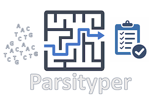

|logo|

|conda| |nbsp| |pypi| |nbsp|  |rtd| |nbsp| |license|

======  ===========
Master  |ci-master|
Dev     |ci-dev|
======  ===========

Introduction
============
Not all biological sample types are true isolates whether that is due to the unculurability of the organism or the analysis
of complex biological samples such as food matricies or primary clinical samples.
Occam's razor or law of parsimony — "entities should not be multiplied without necessity"

Citation
========

Requirements and Dependencies
=============================

Installation
============

Usage
=====
If you run ``parsityper``, you should see the following usage statement:

.. code-block::

    Usage: parsityper <command> [options] <required arguments>

    To get minimal usage for a command use:
    parsityper command

    To get full help for a command use one of:
    parsityper command -h
    parsityper command --help

    Available commands:

    typer    Reconstruct sample genotype(s) from isolate or metagenomic sample
    creator  Create a kmer scheme based on labeled data
    trainer  Train a kmer scheme on labeled genotype data to derive kmer patterns for genotypes
    test     Test parsityper functionality on a small dataset
    version  Print version and exit

Legal
=====

Copyright Government of Canada 2021

Written by: National Microbiology Laboratory, Public Health Agency of Canada

Licensed under the Apache License, Version 2.0 (the "License"); you may not use
this work except in compliance with the License. You may obtain a copy of the
License at:

http://www.apache.org/licenses/LICENSE-2.0

Unless required by applicable law or agreed to in writing, software distributed
under the License is distributed on an "AS IS" BASIS, WITHOUT WARRANTIES OR
CONDITIONS OF ANY KIND, either express or implied. See the License for the
specific language governing permissions and limitations under the License.

Contact
=======

**James Robertson**: james.robertson@canada.ca